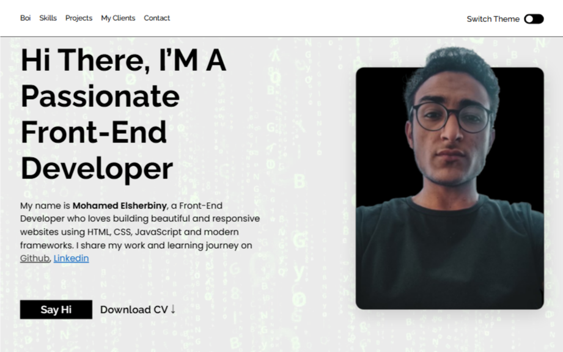

# 🌐 Mohamed Elsherbiny | Personal Portfolio Website

[Live Demo 👀](https://mhmd-sherbiny.github.io/personal-website/)

---

## 👋 About Me

Hi, I'm **Mohamed Elsherbiny**, a passionate **Front-End Developer** who loves building clean, responsive, and user-friendly websites using the latest web technologies.

This website is my personal portfolio, designed to showcase my skills, projects, and background in front-end development.

---

## 🚀 Technologies Used

- **HTML5** – Semantic structure for content  
- **CSS3** – Styling and layout  
- **Sass (SCSS)** – CSS preprocessor for better code organization  
- *(More features with JavaScript & frameworks coming soon)*

---

## 📌 Features

- 🌓 Dark/Light Mode Toggle  
- 📱 Fully Responsive Design  
- 📂 Organized Project Sections: Bio, Skills, Projects, Clients, and Contact  
- 📄 CV Download Button  
- 📸 Profile photo with clean UI  
- 🔗 Social Media Integration (GitHub & LinkedIn)

---

## 🗂️ Project Structure

📁 assets/ → Images and media
📄 index.html → Main HTML structure
📄 style.scss → Main Sass file
📄 style.css → Compiled CSS
📄 script.js → (optional future JS functionality)

---

## 🖼️ Screenshot

---

## 🔗 Live Website

👉 **Visit here:** [mhmd-sherbiny.github.io/personal-website](https://mhmd-sherbiny.github.io/personal-website/)

---

## 📬 Contact Me

- **GitHub**: [@mhmd-sherbiny](https://github.com/mhmd-sherbiny)  
- **LinkedIn**: [Mohamed Elsherbiny]([https://www.linkedin.com/in/your-link-here](https://www.linkedin.com/in/mhmdsherbiny/)) *(replace with actual link)*  
- **Email**: your.email@example.com *(replace with your actual email)*

---

> 🛠️ This is a beginner-level project as part of my learning journey. I'm continuously improving it and adding new features as I learn more.

---

⭐ If you like this project, feel free to star the repo and connect with me!

